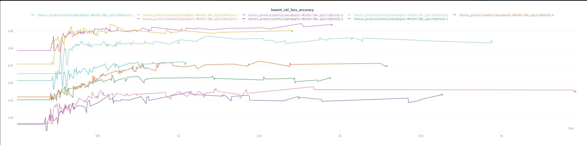

# tennis_AI

# Introduction
In the past my friends and I have always bet on the outcome of tennis matches, and had competitions to see who could fill out the best bracket before tournaments. I want to see how different machine learning methods, particularly random forests and neural networks could be used to help me assert dominance over my friends, and potentially outperform the betting odds.

# Data
The data used is from https://github.com/JeffSackmann/tennis_atp.
It has data stretching from the 1960's to present day on ATP matches, and accompanying variables with each match.

# Feature Engineering

From what I have seen online, when people use machine learning to predict sports matches they will frequently state results such as a validation accuracy of 65%. But in my mind this is not very good if just predicting the favourite everytime will also give you accuracy of 65%.
I set up my network so that there would be one group of features for the "overdog" (favourite), and another group of features for the "underdog". Then the Y variable would be 0 if the overdog won (no upsert), and 1 if the underdog won (upset). This way I would be able to easily see how much better my neural network was performing compared to just predicting the overdog everytime. This was done through underdog_overdog.py.

I then engineering the following features

## Upset Potential

Given that we are trying to predict the possibility of an upset here, it makes sense to engineer features to capture this probability. 

underdog_upset:Total number of times underdog has upset an overdog in career  
underdog_notupset :Total nubmer of times underdog has failed to upset an overdog in career  
underdog_recent_upset: For the last 10 matches  
underdog_recent_notupset: For the last 10 matches  

overdog_gotupset: Total number of times the overdog has been upset as an overdog in career  
overdog_notupset: Total nubmer of times the overdog has not been upset as an overdog in career  
overdog_recent_gotupset: Total number of times the overdog has got upset in past ten matches  
overdog_recent_notupset: Total nubmer of times the overdog has not gotten upset in past ten matches  

## Previous Head2Head

The previous head2head of players is crucial. An underdog may have a particularly good record against an overdog

overdog_h2h_wins: number of career wins over underdog for overdog  
underdog_h2h_wins: number of career wins over underdog for overdog  
overdog_h2h_recent_wins: number of wins in last ten encounters for overdog  
underdog_h2h_recent_wins: number of wins in last ten encounters for underdog  

## Recent Win/Loss
This will give a better picture of how hot the player is. Four features in total: underdog_recent_loss, overdog_recent_loss,underdog_recent_win,overdog_recent_win
Also added in four surface specific recent win/loss metrics. 

total_wins_overdog: overdog total career wins  
total_losses_overdog: overdog total career losses  
recent_wins_overdog: overdog wins in last ten games  
recent_losses_overdog:overdog losses in last ten games  

## Previous Stats

Also include the average of the recorded stats for the past ten matches (e.g. first serve percentage, break points faced, etc.)

# Initial Neural Network Training
train.py
Split the data up so that the test set was just data from 2019-2020. This will be the best way to judge the models ability to predict future outcomes given previous trianing data.
Training was done using cross validation in Pytorch. Experiments were tracked using wandb.

We can see that the validation loss between different folds ranges between 65% to 70%. This is using a 50x4 square network. 
The activation function used was ReLU with exception to the last layer, which was sigmoid.   This is custom practice for binary classification in a neural network
Different network sizes, learning rates, and weight decays were experimented with in an attempt to optimize hyperparameters.

# Feature Selection
Given the poor performance of the initial neural network training, it is likely that many of the features that I engineered are redundant and not worthwhile including.

To investigate this I used a jupyter notebook and random forests.
